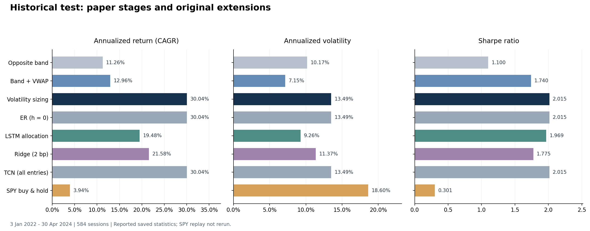

# SPY Intraday Momentum: Replication and Original Research

A chronological Python research project implementing the paper's time-of-day noise bands, breakout rules, current-band/VWAP exits and volatility-based position sizing, then evaluating ER, LSTM, TCN, Ridge, breakout confirmation and intraday shock-control extensions.

**Main observed result:** under a common causal missing-data policy, intraday shock control raises the 2022-2024 historical-test Sharpe from **2.015 to 2.287**, lowers annualized volatility from **13.49% to 11.29%**, and reduces maximum drawdown from **9.95% to 6.24%**. CAGR falls from 30.04% to 28.62%. Validation selects no additional breakout confirmation. The improvement is period-dependent: shock control has lower development Sharpe than its baseline.

**Execution status:** the latest supplied notebook, `SPY_Intraday_Momentum(1).ipynb`, contains execution counts for all 70 code cells, no saved error outputs and 15 PNG figures. Section 11 includes a passed baseline identity check, parameter selection, ablation results and 1x/2x/5x cost stress results. Some notebook Markdown labels still describe it as pending; this README reflects the actual saved outputs. Market-data inputs and fitted model files are not bundled, and this documentation update does not independently rerun the market backtest.

## Case study scope and requirement coverage

This submission follows the three tasks in the *Case Study: Intraday Momentum Strategy for SPY*. The primary source is Zarattini, Aziz and Barbon (2025), version 3 February 2025.

| Case study task | Evidence in this repository |
|---|---|
| Understand the paper's hypothesis, signals, execution and risk controls; discuss favorable and unfavorable regimes | The explanations below, notebook Sections 0-5 and [paper correspondence](docs/paper_correspondence.md) |
| Implement a justified core subset, with chronological train/test separation and transaction costs; plot Sharpe, annualized return and volatility | Notebook Sections 2-5; the split and execution assumptions below; the saved metric overview and original strategy figures |
| Design and evaluate an original variation under comparable assumptions; explain its rationale and further improvements | **Intraday shock control** in Section 11, with confirmation, constant-risk and transaction-cost controls; **LSTM daily allocation** in Section 8 provides a second evaluated variation |

The implemented core is the paper's noise-band breakout, current-band/VWAP exit and daily volatility sizing. This subset isolates the central trading mechanism and makes the effect of each stage reviewable. The paper's separate VIX-regime, pattern, weekday, gamma and significance investigations are outside the implemented scope. Both the LSTM and Section 11 risk-control experiments now have saved evaluations.

## Core hypothesis and trading rules

The economic hypothesis is that unusually large moves away from the opening price can reflect persistent intraday demand or supply imbalance. A time-of-day noise boundary identifies moves that are large relative to recent observations at that same time. Trend following attempts to capture their continuation, while current-band/VWAP exits reduce exposure after the move weakens. The saved backtest measures portfolio outcomes; it does not independently prove that order-flow imbalance causes the returns.

1. **Estimate the noise area.** For each intraday minute, average the absolute open-to-minute return over the preceding 14 sessions. Exclude the current day. This is a mean absolute move, distinct from the daily standard deviation used for sizing.
2. **Allow for the overnight gap.** Multiply the larger of today's open and yesterday's raw close by one plus the noise estimate for the upper band; use the smaller anchor times one minus the estimate for the lower band.
3. **Set the target direction at half-hour decisions.** Go long when the completed close exceeds both the upper band and current session VWAP, short below both the lower band and VWAP, and flat otherwise. The earlier opposite-band version is retained to show the effect of the exit change. Session VWAP uses cumulative HLC3 times volume, a specified bar-based implementation convention.
4. **Size and close the position.** Use the previous 14 completed raw daily returns to estimate sample standard deviation. Planned notional exposure is session-start equity times `min(4, 0.02 / daily_volatility)`. Convert this to integer shares using the opening price. Close all positions at the session end. The 2% daily target is a sizing input, not a guarantee of realized strategy volatility.

### Where the strategy may work or fail

Persistent directional sessions provide an intuitive setting for the momentum hypothesis. Its main weaknesses are:

- **Choppy, mean-reverting sessions:** repeated boundary breaches and reversals can create losses and turnover.
- **Small intraday moves:** potential gains may be too small to cover per-share costs and adverse execution.
- **Sudden volatility increases or sharp reversals:** yesterday's risk estimate can leave excessive exposure before a scheduled decision reacts.
- **Changes in market structure or execution conditions:** a historical pattern can weaken, and spread, impact, latency or short-borrow costs can erode the simulated edge.

These are mechanism-based hypotheses and limitations. This project does not present a new regime-by-regime statistical test. The dynamic baseline's development Sharpe is 0.669 versus 2.015 in the historical test, which also shows why the strongest period should not be treated as a universal outcome.

## Data split, information timing and execution assumptions

The input is Alpaca SIP SPY minute data, with daily features and an NYSE session calendar. Analysis begins in March 2016; earlier observations provide rolling-feature history.

| Role | Dates | Sessions | Use |
|---|---|---:|---|
| Warm-up | 4 January-29 February 2016 | Excluded from performance | Initialize rolling features |
| Development | 1 March 2016-31 December 2020 | 1,220 | Fit preprocessing and model weights |
| Validation | Trading sessions in 2021 | 252 | Select checkpoints and operational thresholds |
| Historical test | 3 January 2022-30 April 2024 | 584 | Evaluate frozen selections |

The source `train` label combines development and validation, totaling 1,472 sessions. There is no random split. LSTM preprocessing and learned weights use development data, validation selects the checkpoint, and the preceding 20-session input window excludes today's observations. The historical test has already been inspected across experiments and is not a fresh blind evaluation.

| Assumption | Implementation |
|---|---|
| Initial equity | USD 100,000; equity compounds through the full evaluation history |
| Commission | USD 0.0035 per traded share, charged on entries, exits and both legs of reversals |
| Adverse slippage | USD 0.001 per traded share in addition to commission |
| Signal and entry timing | Observe a completed half-hour signal bar, then use the next minute's opening price as the execution reference |
| End-of-session exit | Planned liquidation using the terminal closing-price reference, with costs |
| Position limits | Integer shares, maximum planned notional leverage of 4x, no overnight position |
| Performance statistics | Daily net returns, 252 sessions/year, CAGR for annualized return, sample standard deviation for volatility, zero risk-free rate for Sharpe |

A round trip of one share therefore incurs USD 0.009 in the specified linear commission/slippage model before any additional costs. The assumptions are explicit approximations: they do not calibrate a variable bid-ask spread or size-dependent impact, and do not fully model latency, financing or borrow charges.

**Data-quality policy:** Sections 2-10 use a retrospective full-session completeness check and hold incomplete sessions in cash. That convention knows whether data will be missing later in the day. Section 11 instead retains earlier trades, detects missing minutes as they occur, halts further trading and liquidates at the next available reference. Its evaluation reports seven incomplete sessions. All five Section 11 variants use this same causal policy. A separate legacy-mode identity check passes before the extensions are enabled. Compare each extension with its own policy-matched baseline; small differences from the earlier baseline can arise from data handling and the compounded integer-share path.

## Original strategy A: intraday shock control and breakout confirmation

### Design and expected edge

The paper's daily volatility estimate is based on prior sessions. If current intraday volatility rises unexpectedly, that estimate can leave too much exposure. The original risk-control variation compares today's cumulative realized variance with a historical reference at the same elapsed minute, then scales the planned position downward when current variance is unusually high.

Start minute log returns at the actual opening price to exclude the overnight gap. Sum their squares to obtain cumulative realized variance `RV`. Let `H` be its same-minute median over the preceding 14 scheduled sessions, excluding today. At existing half-hour decision times, use:

~~~text
g = min(1, sqrt(H / RV))
target_shares = side * floor(original_daily_share_budget * g)
~~~

If current variance is four times its historical reference, planned exposure is halved. The multiplier may recover toward one but never exceeds the original daily budget. Unavailable or nonpositive historical references leave it at one. Every share adjustment incurs commission and slippage. The expected edge is state-dependent risk reduction; it is not a new long/short forecast.

The second hypothesis is that brief boundary breaches are false breakouts. Confirmation requires the preceding 1, 3 or 5 completed minutes to remain beyond both their own contemporaneous noise boundary and VWAP before opening a new side. Existing exits are retained. A rejected reversal closes the old side without opening the rejected direction. Confirmation cannot cross a missing minute or session boundary.

### Validation selection and ablation design

The shock-control formula and 14-session reference are predefined. Validation selects the confirmation window; test results do not choose it. The saved 2021 validation selection is:

| Confirmation minutes | Validation Sharpe | Active sessions | Rejected entries |
|---:|---:|---:|---:|
| 1 | **1.6520** | 144 | 0 |
| 3 | 1.0104 | 138 | 39 |
| 5 | 1.2993 | 134 | 59 |

Validation therefore selects **m = 1**, retaining the original entry rule. A frozen constant-risk coefficient of **0.8931** is estimated using development data only. All variants use the same causal gap policy, calendar, initial capital, execution references, linear costs and performance definitions:

| Variant | Entry rule | Position sizing |
|---|---|---|
| A Original | Original band/VWAP rule | Daily volatility target |
| B Confirmation | Validation-selected confirmation | Daily volatility target |
| C Shock control | Original band/VWAP rule | Daily budget times intraday multiplier |
| D Combined | Selected confirmation | Daily budget times intraday multiplier |
| E Constant risk | Original band/VWAP rule | Daily budget times frozen 0.8931 coefficient |

Because m = 1, B equals A and D equals C in this run. The overlapping curves are expected. E checks whether the benefit is explained by simply reducing exposure. It is an approximate lower-exposure control, not exact realized-volatility matching.

### Observed results across periods

| Period | Strategy | CAGR | Annual volatility | Sharpe | Maximum drawdown |
|---|---|---:|---:|---:|---:|
| Development | A Original | 9.01% | 14.30% | 0.674 | -25.72% |
| Development | C Shock control | 5.89% | 10.23% | 0.610 | -21.54% |
| Development | E Constant risk | 8.11% | 12.77% | 0.674 | -23.23% |
| Validation | A Original | 27.29% | 15.31% | 1.653 | -6.06% |
| Validation | C Shock control | 24.99% | 9.84% | 2.316 | -4.61% |
| Validation | E Constant risk | 24.19% | 13.67% | 1.653 | -5.42% |
| Historical test | A Original | 30.04% | 13.49% | 2.015 | -9.95% |
| Historical test | C Shock control | 28.62% | 11.29% | **2.287** | **-6.24%** |
| Historical test | E Constant risk | 26.54% | 12.05% | 2.015 | -8.92% |

In the historical test, shock control improves Sharpe by approximately **0.272**, lowers annual volatility by **2.20 percentage points**, and reduces drawdown magnitude by **3.71 percentage points**, while giving up **1.42 percentage points** of CAGR. Its Sharpe exceeds the constant-risk control. This supports dynamic allocation in this observed period, but development Sharpe declines from 0.674 to 0.610, so the result is not uniform across periods.

The risk-control version produces more test orders (1,843 versus 1,082) but fewer traded shares (1,096,508 versus 1,436,096). Under the specified per-share model, its test-period dollar costs are lower (USD 4,934.29 versus USD 6,462.43). More orders do not imply greater cost in this particular model; fixed per-order fees and variable market impact could change that comparison.

### Frozen-parameter transaction-cost stress

The confirmation choice and constant-risk coefficient remain frozen. Multiply both commission and slippage by 1, 2 or 5 and recalculate the complete equity and integer-share path:

| Cost multiplier | Original CAGR | Shock-control CAGR | Original Sharpe | Shock-control Sharpe | Original drawdown | Shock-control drawdown |
|---:|---:|---:|---:|---:|---:|---:|
| 1x | 30.04% | 28.62% | 2.0150 | **2.2870** | -9.95% | -6.24% |
| 2x | 28.70% | 27.45% | 1.9381 | **2.2063** | -10.04% | -6.32% |
| 5x | 24.78% | 23.98% | 1.7077 | **1.9630** | -10.36% | -6.55% |

The risk-adjusted advantage survives these specified cost scenarios. This is sensitivity evidence within the inspected historical test, not a calibrated live spread/impact model or proof of future profitability. The notebook contains the complete five-variant cost table and the corresponding comparison figures.

## Original strategy B: LSTM daily risk allocation

The learned variation preserves the paper-inspired intraday direction and exit rules, while learning **how much of the daily risk budget to use**. A 20-session sequence of eight daily features feeds an LSTM: one-day return, five-day return, price range, candle body, lagged 14-day volatility, relative volume, VIX level and VIX change. A sigmoid head produces an allocation between zero and one that scales the volatility-sized position for that session.

**Design rationale and expected edge.** The same breakout can behave differently across market states. Recent price, volume and volatility sequences may help distinguish persistent trends from states with frequent reversals or unfavorable risk. A bounded allocation allows the model to reduce exposure while retaining a transparent trading rule. This is risk timing rather than a separate long/short direction forecast.

Training uses a net-return Sharpe proxy plus a soft allocation penalty. Development data fit the model; validation selects epoch 80, with reported validation Sharpe 1.805. The held-out historical test uses the frozen selection. The baseline, LSTM and constant-allocation controls share the calendar, starting capital, execution assumptions, per-share costs and evaluation definitions; the allocated share sizes and resulting equity paths differ by design.

| Period | Strategy | CAGR | Annual volatility | Sharpe | Maximum drawdown |
|---|---|---:|---:|---:|---:|
| Development | Volatility-sized baseline | 8.94% | 14.30% | 0.669 | -25.72% |
| Development | LSTM allocation | 7.31% | 8.78% | 0.846 | -12.64% |
| Validation | Volatility-sized baseline | 27.29% | 15.31% | 1.653 | -6.06% |
| Validation | LSTM allocation | 20.55% | 10.67% | 1.805 | -4.16% |
| Historical test | Volatility-sized baseline | 30.04% | 13.49% | 2.015 | -9.95% |
| Historical test | LSTM allocation | 19.48% | 9.26% | 1.969 | -7.59% |

**Observed conclusion.** LSTM improves the reported development and validation Sharpe, but does not exceed baseline Sharpe in the historical test. Its lower test volatility and drawdown accompany lower return. Constant 50% and frozen development-mean allocations both have test Sharpe about 2.015, with drawdowns of 5.06% and 5.89%; these controls prevent simple de-risking from being interpreted as demonstrated timing skill. The saved evidence therefore supports an evaluated original strategy, but does not establish a superior out-of-sample strategy.

The supplementary ER filter selects threshold zero and the TCN selects All entries, retaining the baseline. Ridge selects a 2 bp predicted-payoff threshold but has lower test Sharpe. Full diagnostic tables and figures are in the notebook and [results interpretation](docs/results_interpretation.md).

## Further research

Freeze the current choices before evaluating a later untouched period, and use a predefined chronological rolling development/validation schedule. Assess training stability across seeds and uncertainty with day-block resampling. Compare learned timing with simple exposure controls, improve prediction calibration, and check more realistic execution costs.

Section 11 is now evaluated. Remaining questions include why shock control helps in validation/test but lowers development Sharpe, whether the effect survives later data and more realistic costs, and how often unavailable historical variance references leave exposure unchanged. Half-hour decisions still react with a delay, and historical gap-liquidation references do not guarantee executable live fills.

## Earlier paper and machine-learning comparisons

The following overview covers the eight Section 10 strategies under the earlier full-session completeness convention. The policy-matched Section 11 comparison is reported above; use its A baseline when evaluating shock control.

### Saved historical-test results

3 January 2022-30 April 2024, 584 trading sessions; daily net returns, 252 sessions/year and zero risk-free rate.

| Strategy | CAGR | Annual volatility | Sharpe | Maximum drawdown |
|---|---:|---:|---:|---:|
| Opposite-band baseline | 11.26% | 10.17% | 1.100 | -8.93% |
| Current band + VWAP | 12.96% | 7.15% | 1.740 | -4.67% |
| Band + VWAP + volatility sizing | 30.04% | 13.49% | 2.015 | -9.95% |
| ER, selected threshold 0 | 30.04% | 13.49% | 2.015 | -9.95% |
| LSTM risk allocation | 19.48% | 9.26% | 1.969 | -7.59% |
| Ridge, selected threshold 2 bp | 21.58% | 11.37% | 1.775 | -7.11% |
| TCN, selected All entries | 30.04% | 13.49% | 2.015 | -9.95% |
| SPY buy and hold | 3.94% | 18.60% | 0.301 | -24.50% |

These numbers agree with the latest supplied notebook's saved outputs. The attached notebook is the source for the completed Section 11 tables as well. The original CSVs and fitted weights were not supplied, so no independent market replay is claimed during this README update. The earlier packaged overview image covers Sections 2-10; the latest notebook additionally contains two Section 11 comparison figures.

## Open and understand the project

- [Research notebook](notebooks/SPY_Intraday_Momentum.ipynb)
- [Read-only HTML notebook](docs/notebook_preview.html): download and open locally to see all saved outputs.
- [Paper replication mechanics](docs/paper_correspondence.md)
- [Earlier ER, LSTM, TCN and Ridge diagnostics](docs/results_interpretation.md)
- [Data schema and execution assumptions](data/README.md)
- [Earlier packaging verification record](docs/validation.md)

Sections 0-5 implement the data pipeline and paper-inspired strategies. Sections 6-9 introduce the research protocol and model experiments. Section 10 compares the original eight strategies. Section 11 now contains completed confirmation, intraday risk-control, ablation and cost-stress results. Older notebook conclusion text and supporting documents may still carry the earlier status; the saved outputs and the completed Section 11 interpretation in this README are the current evidence.

## Installation

Use Python 3.11. The source notebook reports Python 3.11.9, but it does not record exact dependency versions. These requirement files list direct dependencies rather than claiming an original locked environment.

~~~bash
python -m venv .venv
~~~

Activate the environment on Windows:

~~~powershell
.venv\Scripts\Activate.ps1
~~~

Or on macOS/Linux:

~~~bash
source .venv/bin/activate
~~~

Install the notebook and paper-stage dependencies:

~~~bash
python -m pip install -r requirements.txt
~~~

For LSTM, TCN and Ridge, additionally install:

~~~bash
python -m pip install -r requirements-models.txt
~~~

## Data and execution

Put your existing project CSVs in `data/`. Alternatively, set `SPY_DATA_DIR` to their absolute directory. The essential input names are `SPY_1min.csv`, `SPY_daily_features.csv` and `NYSE_calendar.csv`.

To request and prepare data explicitly, copy `.env.example` to `.env`, enter your Alpaca credentials locally, then run from the repository root:

~~~bash
python scripts/download_data.py
~~~

The downloader retains the source project's 2016-2024 date settings, SIP feed request and monthly caches. Your data account must authorize the requested feed/history. Source data, private credentials and fitted weights are not bundled.

Run only the replicated paper stages:

~~~bash
python scripts/run_notebook.py --stage paper --data-dir data
~~~

Run the completed model experiments as well:

~~~bash
python scripts/run_notebook.py --stage models --data-dir data
~~~

Rerun the confirmation, risk-control, ablation and cost-grid experiments as well:

~~~bash
python scripts/run_notebook.py --stage all --data-dir data
~~~

The runner disables downloads, clears stale code outputs in its execution copy, and writes a fresh notebook, figures and console outputs to `results/generated/`. Original saved evidence stays separate. Notebook Section 10 can also be run independently: it displays an embedded saved snapshot if live strategy returns are unavailable.

## Verification

~~~bash
python -m pip install -r requirements-dev.txt
python -m pytest -q
~~~

The seven synthetic tests cover replay accounting, reversals, fixed-size equivalence, confirmation and causal gap handling. They passed during the earlier packaging review; the trading functions used by the latest experiment are unchanged. These checks do not measure profitability or independently verify the full market-data replay.

The earlier package's `validate_project.py` and CI workflow assume that Section 11 has no execution outputs. Those status checks need updating when the fully executed notebook replaces the earlier repository copy. Execution counts and absent saved errors establish the supplied notebook's saved completion status, not an independent end-to-end audit.

## Upload to GitHub

Unzip the package and upload the **contents of this repository folder**, with `README.md` at the repository root. For a browser upload, use **Add file -> Upload files**. Upload the source folder contents rather than the ZIP archive.

With Git, run from the unpacked folder:

~~~bash
git init
git add .
git commit -m "Add SPY intraday momentum research project"
git branch -M main
git remote add origin YOUR_REPOSITORY_URL
git push -u origin main
~~~

Replace `YOUR_REPOSITORY_URL` with the URL of your repository. Local credentials, market data, caches and new fitted model files are excluded by `.gitignore`.

## Reference and scope

Zarattini, C., Aziz, A. and Barbon, A. (2025). *Beat the Market: An Effective Intraday Momentum Strategy for S&P500 ETF (SPY).* Version 3 February 2025, Swiss Finance Institute research paper series 24-97.

The article's main sample is May 2007-April 2024 using IQFeed/Matlab. This project's analysis starts in March 2016 and uses Alpaca/Python. It reproduces the core signal/exit/sizing construction, not all VIX, weekday, technical-pattern, gamma or significance analyses. The reference PDF is not redistributed in the repository.

The historical test has already been inspected. Further modifications require a later untouched period to establish new evidence; the saved results are not a fresh blind test.
