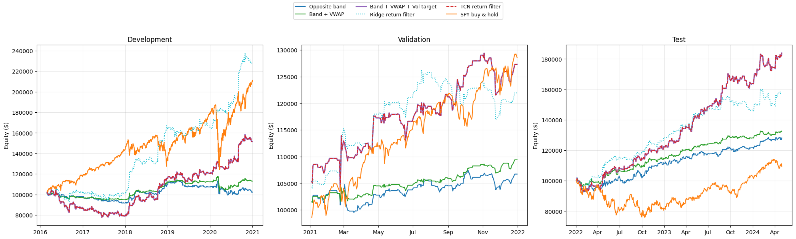

# SPY日内动量策略复现与改进实验

[English README](README.md)

项目按论文的主要方法，依次实现**噪声区间突破 → VWAP止损 → 波动率目标仓位**，再比较ER入场过滤、LSTM风险仓位、TCN收益预测过滤和Ridge线性对照。

**当前保存结果中，论文的波动率目标策略仍然最好。** ER选择阈值0，TCN选择“All entries”，二者没有改变原策略。LSTM降低波动和最大回撤，同时降低收益及Sharpe。仓库如实保留这些结果，展示研究过程和比较依据。

## 先看哪些文件

1. [Strategy.ipynb](Strategy.ipynb)：本次上传文件的原样副本，128个单元格，其中62段代码、66段Markdown，包含12张已保存图片。代码前的说明串联论文逻辑与项目实验。
2. [METHODS.md](docs/METHODS.md)：公式、实现约定、论文方法与Notebook位置的对应。
3. [test_summary.csv](results/test_summary.csv)：测试期全部策略及仓位对照的统计。
4. [REPRODUCIBILITY.md](docs/REPRODUCIBILITY.md)：运行顺序、数据来源、依赖和当前复现边界。

这次整理使用的是Notebook里已保存的输出，没有重新下载行情、训练模型或执行完整回测。部分单元格没有执行计数；文件记录见[provenance.json](results/provenance.json)。

## 测试期结果

测试期为2022年至2024-04-30，共584个交易日。以下是原文件打印出的四舍五入结果；CAGR为几何年化收益，Sharpe假设无风险利率为0。

| 策略 | 累计收益 | CAGR | 年化波动 | Sharpe | 最大回撤 |
| --- | ---: | ---: | ---: | ---: | ---: |
| 反向边界止损 | 28.05% | 11.26% | 10.17% | 1.100 | −8.93% |
| 边界 + VWAP | 32.63% | 12.96% | 7.15% | 1.740 | −4.67% |
| **边界 + VWAP + 波动率目标** | **83.80%** | **30.04%** | **13.49%** | **2.015** | **−9.95%** |
| 波动率目标 + ER | 83.80% | 30.04% | 13.49% | 2.015 | −9.95% |
| LSTM风险仓位 | 51.05% | 19.48% | 9.26% | 1.969 | −7.59% |
| Ridge收益过滤 | 57.26% | 21.58% | 11.37% | 1.775 | −7.11% |
| TCN收益过滤 | 83.80% | 30.04% | 13.49% | 2.015 | −9.95% |
| SPY买入持有 | 9.37% | 3.94% | 18.60% | 0.301 | −24.50% |

LSTM还与固定50%仓位、固定58.39%仓位进行比较。58.39%来自开发期平均权重，没有使用测试期平均仓位来设定对照。两种固定仓位的测试Sharpe均为2.015，高于LSTM的1.969，因此不能仅凭回撤下降认定深度学习改进成功。



这张最终图展示6条策略；TCN与波动率目标策略重合。[LSTM及仓位对照图](assets/lstm_equity.png)、[LSTM权重图](assets/lstm_allocation.png)、[ER对比图](assets/er_equity.png)分别保留。

## 研究设置

- 行情下载从2016-01-04开始，2016-03-01开始评估。
- 原策略训练区间截止2021-12-31。扩展实验用截至2020年的1220个交易日开发，2021年的252个交易日验证，之后584个交易日测试。
- 初始资金100,000美元；每次成交每股佣金0.0035美元，逆向滑点0.001美元。
- 每逢整点或半点，依据已结束的分钟K线生成信号，在下一分钟开盘价成交；收盘清仓。
- 用过去14日收益的标准差设定仓位，日波动率目标2%，杠杆上限4倍。
- 验证期选择：ER阈值0；LSTM第80轮；TCN第5轮、不过滤；Ridge阈值2 bp。

## 如何运行

Notebook元数据记录Python 3.11.9，建议使用Python 3.11。从仓库根目录启动：

```bash
python -m pip install -r requirements.txt
python -m jupyterlab
```

打开`Strategy.ipynb`并按顺序执行。下载段读取环境变量`APCA_API_KEY_ID`、`APCA_API_SECRET_KEY`，未设置时会通过`getpass`提示输入。原文件中的凭据字段保持空白。账户需要能访问代码请求的历史SIP行情；CSV和缓存由下载代码生成，已加入Git忽略规则。

也可以运行`python scripts/download_data.py`单独准备数据；之后在Notebook中从噪声区间构造部分开始。`python scripts/export_saved_results.py`只提取已有输出，不执行Notebook，且只需要Python标准库。

本仓库未附原始行情、训练后的模型或原环境完整版本锁。论文样本为2007–2024年，本项目使用2016–2024年数据，且存在HLC3近似VWAP、下一分钟开盘成交、完整日检查等实现约定。[方法说明](docs/METHODS.md)列出了这些差别。当前结果已经在研究过程中查看过，需要新样本或滚动验证才能进一步评价泛化能力。

上传GitHub时，按照[UPLOAD.md](docs/UPLOAD.md)将解压后的文件放到仓库根目录。
